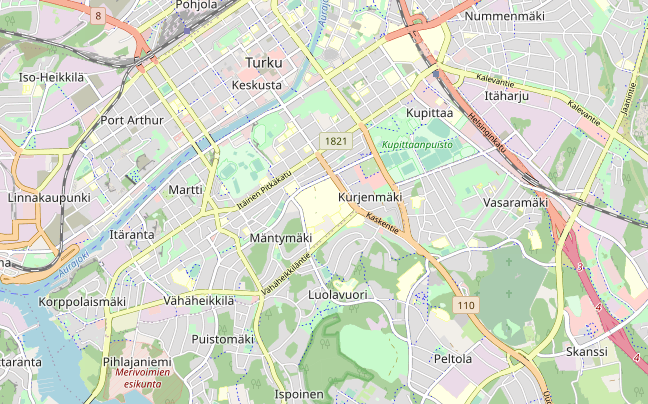
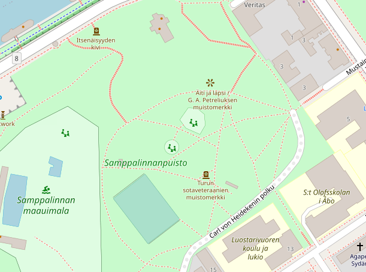

# Super-resolution for different zoom levels in maps

Final project for the Building AI course

## Summary

In online maps like [Google Maps](maps.google.com/) and
[OpenStreetMap](https://www.openstreetmap.org/) one can view the world at
different zoom levels. But what if you are already looking at the highest
available zoom level of the area or you are not satisfied with the reality?
Could AI generate super-resolution versions of the map?

## Background

_Image-to-image translation_ means learning the mapping from an input image to a
target image. Choosing between existing algorithms and developing a new approach
will require further research. However, here we present two existing
image-to-image translation concepts to give an idea of the method.

_Super-resolution_ for images using deep learning, GANs, or other AI methods is
fairly recent technology. In implementations a low-resolution image is upscaled
upto 16 times (4 in each direction), and the added pixels are filled with data
generated by AI. The AI has learnt the pixels to use from analysing perhaps
millions of images in high and low resolution.

Another possible technique is so-called _image inpainting_ (see e.g.,
https://www.nvidia.com/research/inpainting/ and
https://www.theconvolvedblog.vision/#inpaint). In it, damaged or missing parts of
an image are reconstructed based on the remaining image. Typically inpainting is
used to remove scratches or small objects from photos, but it could be adapted
for other use cases as well.

Some very interesting image-to-image translation projects are
[pix2pix](https://github.com/phillipi/pix2pix),
[CycleGAN](https://junyanz.github.io/CycleGAN/), and [Contrastive Unpaired
Translation](https://github.com/taesungp/contrastive-unpaired-translation).
Especially the description of pix2pix suggests that it could be at least tested
for the problem at hand.

In online maps like [Google Maps](maps.google.com/) and
[OpenStreetMap](https://www.openstreetmap.org/) one can view the world at
different zoom levels. Low zoom levels show few details, like country names and
borders.

Map view from Turku, Finland, with low-level zoom (from OpenStreetMap):

Zooming in, more details, such as cities, rivers, and streets, become visible.
In cities maps typically show all streets, alleys, buildings, and even some
statues and memorials.

Whereas some features shown on the map are present and shown in almost all zoom
levels, some of them are only shown in suitable (usually high) zoom levels. For
example seas and rivers are visible in more zoom levels than streets. Therefore,
zooming in and out of a map is not simply a question of upscaling and
downscaling the image. Instead, the map viewer actively shows, hides and
arranges items in the view.

Map view from Turku, Finland, with high-level zoom (from OpenStreetMap):

Extract from the low-level zoomed image produced by bigjpg.com 

But what if you are already looking at the highest available zoom level of the
area or you are not satisfied with the reality? Could AI generate
super-resolution versions of the map?

The uses for AI-generated maps are two-fold. First, in limited cases the
generated map might match the reality rather well. This could happen when the
environment is uniform, like a forest containing more forest, or all blocks in a
city being alike.

Second, the AI-generated maps could be a source of inspiration or amusement.
Perhaps one would wonder what kind of park or open space would be between
streets, if the place were (and the AI system were trained with data from)
somewhere else on Earth. The built environment is quite different in, say, Asia,
Middle East, Europe and different parts of the Americas.

## How is it used?

The most natural way to use the solution would be to have the output used as a
map layer in a map application. The user could pan the map and focus on the
areas that interest him or her. Ideally the solution could be used on any zoom
level and anywhere on Earth, but for performance reasons the map tiles might
have to be generated in advance and cover only some regions or zoom levels.

## Data sources and AI methods

The main source of data is expected to be
[OpenStreetMap](https://www.openstreetmap.org/), since the Open Data Commons
Open Database License allows liberal use of their data. One can download the map
data for the whole world or for a smaller area, and generate practically an
unlimited amount of training data (rendered map tiles) at different zoom levels.

The actual AI methods will be determined after studying existing image-to-image
translation solutions. The two solutions discussed earlier (super-resolution and
inpainting) do not match exactly with the present problem. However, studying
them will provide useful insight into the necessary algorithms.

Technically one could train the AI using the underlying features (knowledge of
the roads, buildings, and their coordinates) instead of working on the rendered
output (the image we see). However, that should be separate endeavour with its own challenges and solutions.

## Challenges

Bigger challenges are expected concerning two aspects in this project: tile
borders and text. When smaller map tiles are joined together, it is possible
that the AI-generated content doesn't line up nicely. Perhaps they don't even
match at all, and one side shows the beginnings of a building while the other
side is open space.

It will be interesting to see how text should be handled. When rendering the
training material it is of course possible to remove all text (e.g., street
names and numbers), but should they be included, and if so, will the AI learn to
keep the text intact, even if possibly moved elsewhere in the tile?

There are no ethical issues expected from this project.

## What next?

This project needs a great deal of experimentation. With some experience and
computing resources and time, it should be possible to see how well the current
general purpose image-to-image translation code bases perform in this project.
After that is done one can plan further improvements.

## Acknowledgments

* [AMBERER](https://amberer.gitlab.io/papers_in_ai/img2img-translation.html)
* [OpenStreetMap.org](https://www.openstreetmap.org/)
* [bigjpg.com](https://bigjpg.com/)
